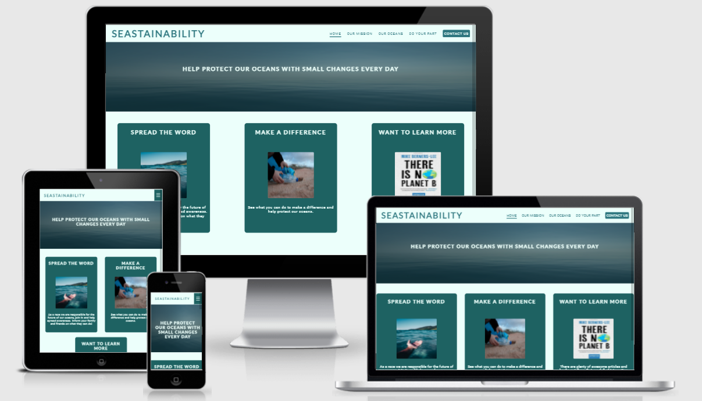
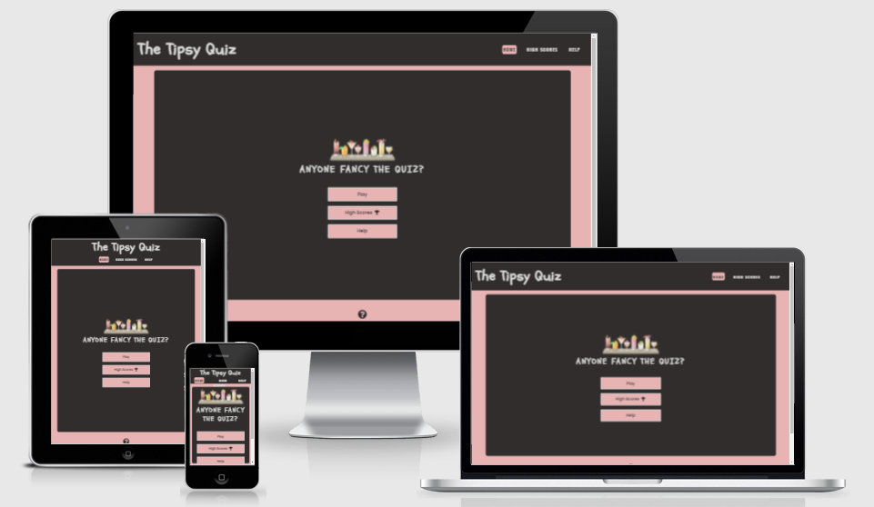
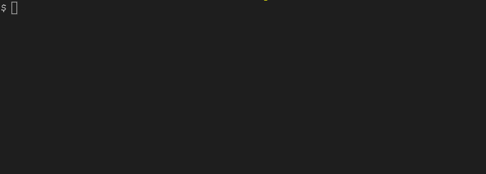

<h1 align="center"> 👋 Hi, I'm Ruairidh(Roo)</h1>

- 👀 I’m a Full Stack Developer with a keen eye for detail.
- 🌱 I’m currently Studying, Diploma in Software Development through Code Institute.
- 🎓 I'm currently working on a Full-Stack Django application.
- 📫 If you want to get in touch, contact me on [LinkedIn](https://www.linkedin.com/in/ruairidh-macarthur-23427a191/)
- 📑 Click [here](./cv/ruairidh-macarthur.pdf) to take a look at my CV.

<h2 align="center">📖 Languages and Tools 🛠</h2>

<h2 align="center"> 👨🏻‍🎓Code Institute Portfolio Projects👨🏻‍🎓 </h2>

### PP1 - SEASTAINABILITY - Merit

[Repository](https://github.com/roomacarthur/seastainability)

[Live Site](https://roomacarthur.github.io/seastainability/index.html)

### PP2 - The Tipsy Quiz - Distinction

[Repository](https://github.com/roomacarthur/the-tipsy-quiz)

[Live Site](https://roomacarthur.github.io/the-tipsy-quiz/)

### PP3 - Escape The Cave - awaiting result.

[Repository](https://github.com/roomacarthur/escape-the-cave)

[Live site](https://escape-the-cave.herokuapp.com/)

